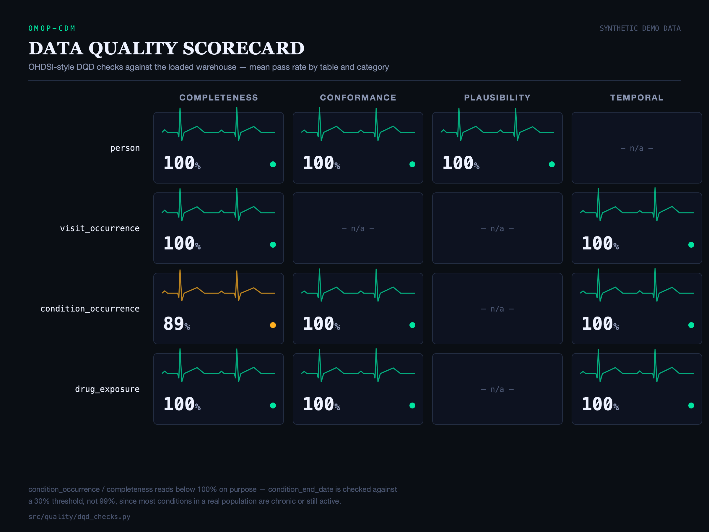
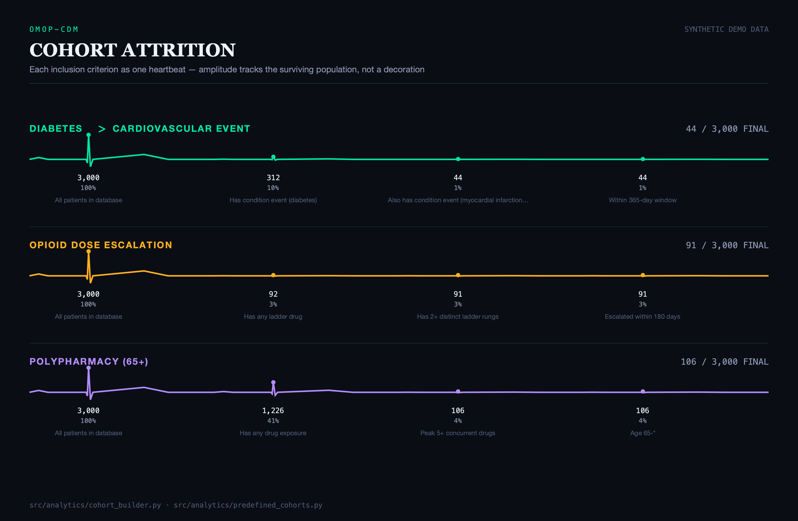
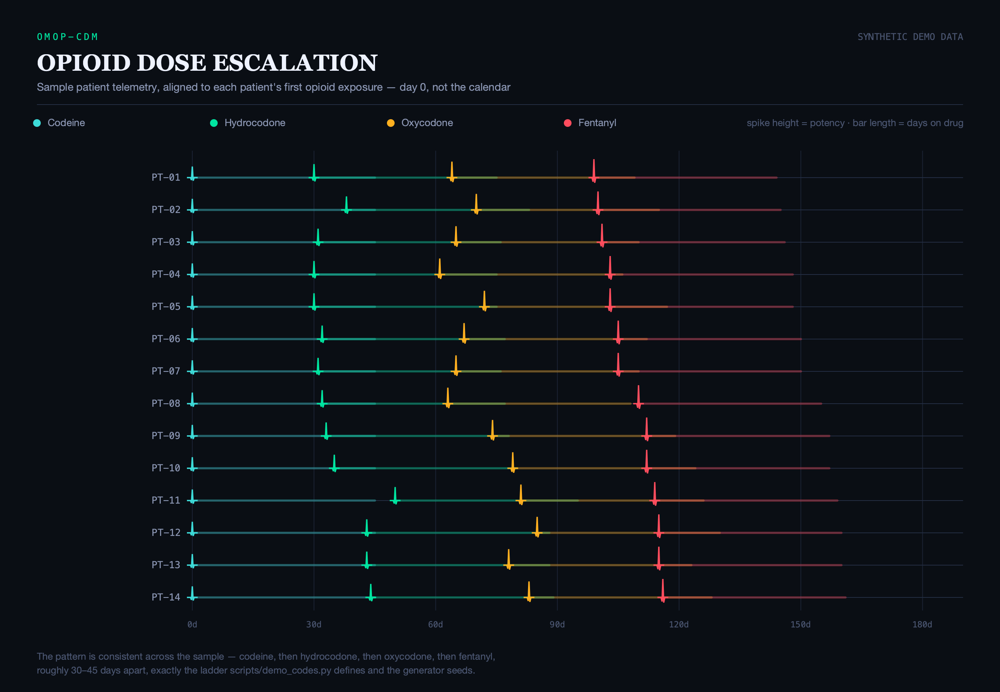
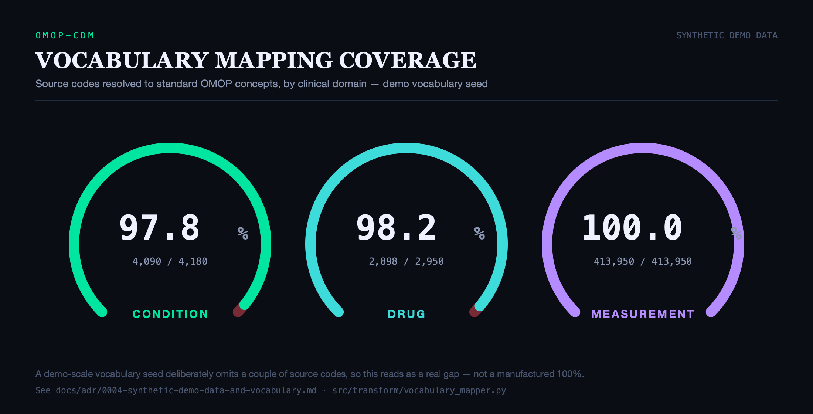
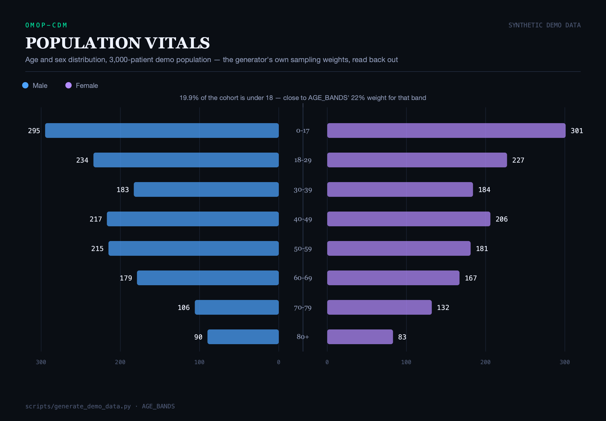

# EHR-to-OMOP Data Warehouse

I built this to work through, end to end, what it actually takes to turn a raw EHR
export into something a research network could run observational studies against.
The OMOP Common Data Model is the thing 300+ institutions in the OHDSI network have
standardized on, and there's a real gap between reading the spec and having lived
through the parts of it that are actually hard — resolving a source vocabulary
against a standard one, deciding what a NOT NULL column means when your source data
genuinely doesn't have an answer, figuring out why your quality checks are all
passing when a real dataset never has zero problems. This project is Synthea-
generated synthetic patients run through a real pipeline into a real OMOP v5.4
warehouse, with the quality checks, the SQL-native second implementation, and the
analytics layer that make a warehouse like this useful in the first place.

Everything in this repo runs. That mattered enough to me that I want to say it
plainly up front: `python -m src.main --stage all` takes a synthetic population from
raw CSVs to a loaded, tested, quality-checked warehouse in under 30 seconds, with no
external services to stand up. I'll get into what "runs" cost me to guarantee further
down — several real bugs only showed up once I actually executed this instead of
just writing code that looked right.

---

## Table of contents

- [Architecture](#architecture)
- [What this demonstrates](#what-this-demonstrates)
- [Getting started](#getting-started)
- [The pipeline](#the-pipeline)
- [The dbt layer](#the-dbt-layer)
- [Data quality](#data-quality)
- [Cohort analytics](#cohort-analytics)
- [Visualizations](#visualizations)
- [Orchestration](#orchestration)
- [Testing and CI](#testing-and-ci)
- [Project structure](#project-structure)
- [Design decisions](#design-decisions)
- [What's demo-scale vs. production](#whats-demo-scale-vs-production)
- [References](#references)

---

## Architecture

```
Synthea CSVs ──▶ Extract ──▶ Transform ──▶ Load ──▶ Quality ──▶ Analytics
                   │            │            │          │
                   ▼            ▼            ▼          ▼
             Great          VocabularyMapper  cdm.*    DQD checks
             Expectations   (SNOMED/RxNorm/   schema   (sys.exit(1)
             (schema, null  LOINC → standard  Postgres  on critical
             rates, ranges) concept_ids)      or DuckDB failure)
                                                  │
                                                  ▼
                                          dbt (independent
                                          second build,
                                          cdm_dbt schema)
                                                  │
                                                  ▼
                                        Cohort engine + 5 hand-built
                                        SVG visualizations (notebooks/)
```

Airflow orchestrates the production path — `extract → transform → load → quality →
dbt_build`, with the quality stage a real gate: a critical DQD failure calls
`sys.exit(1)` and stops `dbt_build` from ever running against a warehouse that failed
its own checks. Locally, the same five stages run through one CLI with no
orchestrator at all.

---

## What this demonstrates

| Area | What's actually here |
|---|---|
| Healthcare data standards | Full OMOP CDM v5.4 schema (37 tables, correctly keyed and constrained), SNOMED CT / RxNorm / LOINC vocabulary resolution |
| ETL pipeline design | Extract → transform → load with a staging layer that makes each stage independently re-runnable, not one fused script |
| Dual implementation | The same transform built twice — pandas in `src/transform/`, SQL in `dbt/` — cross-checked against each other, not just against themselves |
| Data quality | A Great Expectations suite at extract time, an OHDSI-style DQD suite at load time, both wired as real gates, not just reports |
| Cohort analytics | A domain-agnostic temporal cohort engine (not three hardcoded phenotypes) supporting index→outcome, potency-ladder sequences, and peak-concurrency queries |
| Orchestration | A real Airflow DAG, verified to parse via `DagBag`, with a custom Dockerfile since the base Airflow image has neither this project's dependencies nor dbt |
| Testing | 43 tests: unit tests against real embedded databases (not mocks), a full end-to-end integration test through the actual CLI entrypoint |
| Visualization | 5 hand-built SVG charts generated from notebooks — no chart-library defaults — where the geometry (a gauge arc, an EKG trace, a telemetry spike) is the actual data encoding, not decoration on top of it |

---

## Getting started

### Local demo — no Docker, no external accounts

```bash
git clone https://github.com/Kenny0bi/ehr-to-omop-warehouse.git
cd ehr-to-omop-warehouse
python3 -m venv .venv && source .venv/bin/activate
pip install -r requirements.txt

# Build a demo vocabulary and a synthetic patient population
python -m scripts.build_demo_vocabulary
python -m scripts.generate_demo_data --population 3000

# Run the full pipeline
python -m src.main --stage all
```

This is the path I actually run and test against. It uses DuckDB — an embedded,
zero-install database — as the warehouse backend, so there's nothing to stand up
first. See [ADR 0001](docs/adr/0001-dual-warehouse-backend.md) for why.

### Production path — Postgres + Airflow via Docker

```bash
docker compose up -d
python scripts/download_vocabularies.py path/to/athena-export.zip   # needs an
                                                                       # athena.ohdsi.org
                                                                       # account
python scripts/generate_synthea_data.py --population 10000           # needs a JVM
```

Airflow's at `localhost:8080` (admin/admin). The `ehr_to_omop_pipeline` DAG runs the
same five stages the local CLI does, plus `dbt_build` against the same Postgres
instance.

### Run the analysis notebooks

```bash
jupyter lab notebooks/
```

Each notebook reads from whichever warehouse `WAREHOUSE_BACKEND` points at (DuckDB by
default) and regenerates the charts in `docs/assets/visualizations/` in place.

---

## The pipeline

**Extract** (`src/extract/synthea_loader.py`) reads the six Synthea CSVs, checks
every expected column is present, and loads them into staging tables — `stg_patients`,
`stg_encounters`, and so on. Nothing gets reshaped here; staging is a straight
mirror of the source, which is what makes extract and transform independently
re-runnable rather than one fused step. Right after loading, a Great Expectations
suite (`src/quality/ge_suites.py`) checks each staging table for real problems —
null rates, out-of-range categorical values, malformed dates — separate from the
column-presence check extract already did. Every source table over 20,000 rows gets
validated against a sample rather than row-for-row; GE's pandas execution engine
materializes metrics in Python rather than pushing checks into a query engine, and a
full run against the 400K+-row observations table was still going after several
minutes before I added sampling.

**Transform** (`src/transform/`) is the core of the project. `VocabularyMapper`
loads the Athena-format `CONCEPT.csv` / `CONCEPT_RELATIONSHIP.csv` files into an
indexed dict lookup — I started with a pandas boolean-mask filter per call, which is
fine for a handful of lookups and genuinely bad at pipeline scale: 68,943 rows took
35 seconds against a 73-row concept table, because the cost was pandas' own per-call
overhead, not the table size. `omop_transformer.py` then reshapes each staging table
into its OMOP counterpart, resolving every source code through the mapper and
generating the surrogate keys OMOP's schema expects.

**Load** (`src/load/warehouse_loader.py`) writes the transformed tables into the
`cdm` schema, in dependency order (`person` before anything referencing
`person_id`), clearing every table before any table reloads so a delete never
orphans a row another table's foreign key points at. Both this and extract go
through `src/db_utils.py`'s `bulk_write()` rather than calling `to_sql()` directly —
DuckDB has its own, dramatically faster way to load a DataFrame (register it as a
view, `INSERT INTO ... SELECT * FROM` it), and the difference isn't marginal: I
measured a 400,000-row frame at 43.6 seconds through `to_sql(method="multi")` and
0.09 seconds through DuckDB's native path.

**Quality** (`src/quality/dqd_checks.py`) runs a subset of OHDSI's Data Quality
Dashboard against the loaded warehouse — completeness, conformance (do concept_ids
reference real concepts), plausibility (are values in a clinically sane range),
temporal consistency (does a start date actually precede its end date). A critical
failure halts the pipeline; see [Data quality](#data-quality) below for what's
actually in the current scorecard.

---

## The dbt layer

`dbt/` is a second, independent implementation of the transform — the same job
`omop_transformer.py` does in pandas, done again in SQL. That's deliberate, not
duplication for its own sake: having two implementations of the same transform means
dbt's own test suite functions as a real cross-check on the Python pipeline's output,
not just a check that dbt's SQL is internally consistent with itself. I checked this
directly — every table both sides build (`person`, `visit_occurrence`,
`condition_occurrence`, `drug_exposure`, `measurement`) produces identical row counts
against the same demo warehouse.

dbt's marts write to `cdm_dbt`, not `cdm` — `cdm` is the Python pipeline's, and since
dbt marts are `+materialized: table`, pointing dbt at the same schema would mean
every `dbt run` silently drops and rebuilds whatever the Python pipeline just loaded.
See [ADR 0002](docs/adr/0002-dbt-independent-implementation.md) for the full
reasoning, including a genuine circular foreign-key problem the vocabulary tables'
DDL ran into along the way.

```
dbt/models/
├── staging/       6 models — 1:1 typed mirrors of every Synthea source table
├── intermediate/  3 models — vocabulary resolution against cdm.concept /
│                  cdm.concept_relationship (a source, not a dbt-owned table),
│                  the SQL-native version of VocabularyMapper.resolve()
└── marts/         5 models — person, visit_occurrence, condition_occurrence,
                   drug_exposure, measurement, in cdm_dbt
```

83 dbt tests run across these models — uniqueness, not-null, referential integrity,
accepted values. Run it yourself:

```bash
cd dbt && dbt build --profiles-dir .
```

---

## Data quality

Two layers, checking different things at different stages. Great Expectations
checks source files right after extract, before anything's been reshaped. DQD checks
the loaded warehouse, after transform and vocabulary resolution.

Here's the current scorecard, generated by `notebooks/02_data_quality_scorecard.ipynb`:



`condition_occurrence` / `completeness` reads below 100%, and it's supposed to:
`condition_end_date` is checked against a 30% threshold, not 99%, because most
conditions in a real population are chronic or still active — a high completeness
rate there would be the surprising result. I added that check specifically because
every other cell in this scorecard read a flat 100% against my demo data, which is
accurate but not a very convincing demonstration that the quality layer catches
anything — a check against a field that's genuinely, realistically partial gives the
scorecard something real to show, rather than manufacturing a failure just to make
the chart less boring.

---

## Cohort analytics

`src/analytics/cohort_builder.py` started as a single pattern — drug exposure
followed by a condition within a window, matching its own docstring's example
(`metformin` → `lactic acidosis`). The three phenotypes this project actually reports
on turned out to need three different shapes of temporal logic, which is most of why
`CohortBuilder` looks the way it does now:

| Cohort | Shape | Demo result |
|---|---|---|
| `diabetes_complications` | index→outcome, generalized to work across *any* pair of clinical domains — this one's condition→condition (a T2DM diagnosis followed by a cardiovascular event), not drug→condition | 44 of 3,000 |
| `opioid_escalation` | an ordered potency ladder (codeine → hydrocodone → oxycodone → fentanyl); qualifies on 2+ rungs reached within a window | 91 of 3,000 |
| `polypharmacy_elderly` | peak concurrently-active drug count — no "first this, then that" story at all, just an overlap count | 106 of 3,000, age 65+ |

`polypharmacy_elderly` is the one worth telling the actual story of, because "it
works now" undersells what got it there. The first version anchored to a single
reference date — the population's max `drug_exposure_end_date` — and checked who had
5+ drugs active on that one specific day. It returned almost nobody, twice, for two
unrelated reasons: first, a single global date is fragile by construction (whichever
one row happens to hold the extreme value sets the whole query); then, after fixing
that, because `drug_exposure_end_date` for a still-open prescription was falling
back to its own start date — a one-day exposure — instead of a duration that
actually reflected a multi-year prescription. The real fix was a proper
peak-concurrency calculation: a sweep-line, a +1 event at each exposure's start and a
-1 the day after it ends, a running sum per person in date order. Even that had a
one-off bug at first — two exposures ending and starting on the same calendar day
briefly counted as overlapping when they weren't — caught by a test built
specifically for that boundary. Full writeup in
[ADR 0005](docs/adr/0005-generalized-cohort-engine.md).



Each inclusion criterion is drawn as one heartbeat, and the trace's amplitude *is*
the surviving population at that step — not a bar, not a funnel, an EKG line that
visibly flattens as a cohort narrows from 3,000 down to 44, 91, or 106. I tried the
conventional funnel first and ran into the same problem real cohort attrition always
causes for that shape: it routinely runs from 100% down to 1-4% of the source
population, and a funnel's later segments get too thin to hold their own label at
that ratio no matter where the text goes. The flatline doesn't have that failure
mode — a nearly-flat trace at 1% reads as clearly as a tall spike at 100%, because
height was never doing the only work; the number underneath it is doing the rest.

For the escalation cohort specifically, the attrition trace doesn't show what
escalation actually *looks like* — that's a separate chart, a 14-patient telemetry
strip aligned to each patient's own first opioid exposure (day 0) rather than the
calendar, since patients here range decades apart in age and a shared calendar axis
would compress every patient's few-month escalation window into an indistinguishable
sliver. Each prescription is one spike: height and color both climb with the drug's
position on the potency ladder (codeine's a small cyan blip, fentanyl's a tall red
one), and the glowing bar trailing each spike is how long that prescription actually
ran:



---

## Visualizations

The first pass at these five charts used Plotly — a Sankey, a heatmap, a funnel, a
Gantt bar, a pyramid — reskinned with a validated colorblind-safe palette. They were
accurate, and they looked like every other data-journalism chart built the same way,
because that's what those forms are: correct, general-purpose, and generic. I went
looking at how The Pudding thinks about this (their own "How to Make Dope Shit"
series) and kept landing on the same idea from different angles: the chart form
should come from the subject, not from a library's chart-type picker. So I rebuilt
all five as hand-written SVG — no chart library at all — built around the one shape
that already means "this is about a patient's vitals" to almost anyone: an EKG trace.
Every waveform, gauge arc, and telemetry spike below is real geometry computed from
the actual numbers in `data/processed/omop_demo.duckdb`, not a decorative skin over
a default chart type — in three of the five, the trace's shape isn't stylistic at
all, it's how the data is encoded. Rendered with `cairosvg` straight to PNG; no
browser involved. Generated from the notebooks in `notebooks/`, saved into
`docs/assets/visualizations/` as matched `.svg`/`.png` pairs.

**Vocabulary mapping coverage** — three gauge dials, one per clinical domain, each
reading the real `mapped / total` ratio for that domain's OMOP concept column.
Condition and drug read 97.8% and 98.2%; measurement reads 100.0% against this demo
vocabulary seed. The unfilled arc is drawn in red at low opacity rather than a
neutral gray, specifically so a 2% gap still reads as a gap at a glance instead of
disappearing into the dark background — a manufactured 100% would be a less honest
chart than one where the small shortfall is visible on purpose.



**Data quality scorecard** — covered above: a 4×4 grid of monitor cards, one per
table/category pair, each with its own small EKG sparkline whose amplitude drops
with the pass rate, plus a monospace percentage readout and a glowing status dot.

**Cohort attrition** and **opioid escalation timeline** — covered above: three
flatlining EKG traces for attrition, a 14-patient telemetry strip for escalation.

**Population demographics** — an age-sex pyramid, restyled but not reinvented; the
traditional form is still the right one for this job, so it stays a pyramid, back-
to-back horizontal bars in blue and violet against the same dark monitor surface as
the other four. It's as much a sanity check on the demo data generator as a chart in
its own right — a bug in `scripts/generate_demo_data.py`'s age-band sampling weights
would show up here first — which is why the ~20%-under-18 band gets called out
directly on the chart rather than left for the reader to notice on their own.



---

## Orchestration

`airflow/dags/ehr_to_omop_pipeline.py` runs `extract → transform → load → quality →
dbt_build` as five `BashOperator` tasks, each one `python -m src.main --stage <name>`
— the same command a developer runs by hand locally. The DAG's job is sequencing and
retries, not a second copy of the pipeline's own logic.

`quality` is a real gate: `src/main.py`'s quality stage calls `sys.exit(1)` when a
DQD check marked `CRITICAL` fails, which fails that Airflow task and stops
`dbt_build` from running against a warehouse that already failed its own checks.

The base `apache/airflow` image has neither this project's Python dependencies nor
dbt, so `airflow/Dockerfile` extends it with both — and Airflow's own dependency
pins collide with `pydantic-settings` if installed into the same environment as the
rest of this project's tooling, which is exactly why they stay isolated to Airflow's
own container rather than a shared virtualenv. `docker-compose.yml` runs a one-shot
`airflow-init` service (`airflow db init` plus the admin user) that both
`airflow-webserver` and `airflow-scheduler` wait on via
`condition: service_completed_successfully`, instead of racing each other to
initialize the same metadata database — and `sql/schema/00_create_airflow_db.sql`
creates that metadata database in the first place, since nothing else in this repo
did before I added it.

`schedule=None` in the DAG is deliberate: this pipeline processes a fixed synthetic
population, not data that arrives on its own schedule. Triggering it is a deliberate
action — a new demo population, a vocabulary refresh — not something that should
happen unattended at 2am.

---

## Testing and CI

43 tests, all against real embedded databases rather than mocks — the whole premise
of the dual-backend design is that the SQL runs unchanged against DuckDB and
Postgres, and a mocked connection wouldn't actually verify that claim.

```bash
pytest tests/ -v
```

| File | What it covers |
|---|---|
| `test_vocabulary_mapper.py` | Source code → standard concept resolution, including the "Maps to" chain |
| `test_omop_transformer.py` | Every transform function, including the index-fragility bug `_generate_ids` used to have |
| `test_warehouse_loader.py` | Load ordering, clearing, required-column validation |
| `test_cohort_builder.py` | All three cohort execution shapes, including the same-day tie-break edge case |
| `test_predefined_cohorts.py` | The three concrete phenotype definitions wire correctly onto the engine |
| `test_integration_pipeline.py` | The actual CLI, extract through quality, against a real generated population — including a referential-integrity check DuckDB itself doesn't enforce (see [ADR 0001](docs/adr/0001-dual-warehouse-backend.md)) |

GitHub Actions (`.github/workflows/ci.yml`) runs ruff, mypy, and the full test suite
on every push and PR, plus a separate job that verifies the Airflow DAG actually
parses via `DagBag`, plus a third that generates a small demo population and runs
`dbt build` against it — three jobs, because a lint pass, a DAG that imports cleanly,
and a dbt build that succeeds are three different claims, and I'd rather see which
one broke than a single job named "everything."

---

## Project structure

```
ehr-to-omop-warehouse/
├── src/
│   ├── config/          Pydantic settings — dual warehouse backend, paths
│   ├── extract/         Synthea CSV → staging tables
│   ├── transform/       Vocabulary mapping, OMOP reshaping
│   ├── load/            Staging/OMOP → warehouse, fast bulk-write path
│   ├── quality/         Great Expectations (source) + DQD (warehouse)
│   ├── analytics/       Cohort engine + the three predefined phenotypes
│   └── db_utils.py      Shared fast bulk-write helper (src/extract and src/load)
├── dbt/                 Independent second implementation — see The dbt layer
├── airflow/dags/        The production orchestration DAG
├── sql/schema/          Full OMOP CDM v5.4 DDL (37 tables)
├── scripts/             Demo data/vocabulary generators + real Synthea/Athena wrappers
├── notebooks/           The 5 visualizations, as executed Jupyter notebooks
├── docs/
│   ├── adr/             Architecture decision records
│   └── assets/          Exported chart SVG + PNG
└── tests/               43 tests, against real embedded databases
```

---

## Design decisions

The reasoning behind the choices that had a real alternative on the table, written
up properly rather than left to a commit message:

- [0001 — Dual warehouse backend](docs/adr/0001-dual-warehouse-backend.md)
- [0002 — dbt as an independent implementation](docs/adr/0002-dbt-independent-implementation.md)
- [0003 — Full OMOP DDL, partial population](docs/adr/0003-full-omop-ddl-partial-population.md)
- [0004 — Synthetic demo data and vocabulary](docs/adr/0004-synthetic-demo-data-and-vocabulary.md)
- [0005 — Generalized cohort engine](docs/adr/0005-generalized-cohort-engine.md)

---

## What's demo-scale vs. production

Worth being direct about, rather than letting it blur together:

| | Demo (what I ran and tested) | Production (what's built for it, not personally run) |
|---|---|---|
| Warehouse | DuckDB, embedded | Postgres via docker-compose |
| Vocabulary | ~40 hand-picked SNOMED/RxNorm/LOINC codes, real codes with locally-assigned concept_ids (see [ADR 0004](docs/adr/0004-synthetic-demo-data-and-vocabulary.md)) | Full Athena export via `scripts/download_vocabularies.py` |
| Population | Synthetic, `scripts/generate_demo_data.py`, 3,000 patients | Real Synthea generation via `scripts/generate_synthea_data.py`, needs a JVM |
| Foreign keys | Not enforced (DuckDB doesn't support `ALTER TABLE ADD CONSTRAINT FOREIGN KEY`) | Fully enforced by Postgres |
| Orchestration | None — one CLI command | Airflow, via docker-compose |

Every number in this README — the cohort sizes, the mapping coverage percentages,
the quality scorecard — comes from the demo path, run against synthetic data with a
fixed random seed. None of it represents a finding about a real population; all of
it is real evidence that the pipeline, the quality checks, and the analytics layer
actually work end to end.

---

## References

- [OMOP Common Data Model v5.4](https://ohdsi.github.io/CommonDataModel/cdm54.html)
- [OHDSI Book of OHDSI](https://ohdsi.github.io/TheBookOfOhdsi/)
- [Synthea Patient Generator](https://github.com/synthetichealth/synthea)
- [OHDSI Athena Vocabularies](https://athena.ohdsi.org/)
- [OHDSI Data Quality Dashboard](https://ohdsi.github.io/DataQualityDashboard/)
- [dbt documentation](https://docs.getdbt.com/)
- [Apache Airflow documentation](https://airflow.apache.org/docs/)

---

## License

[MIT](LICENSE)
